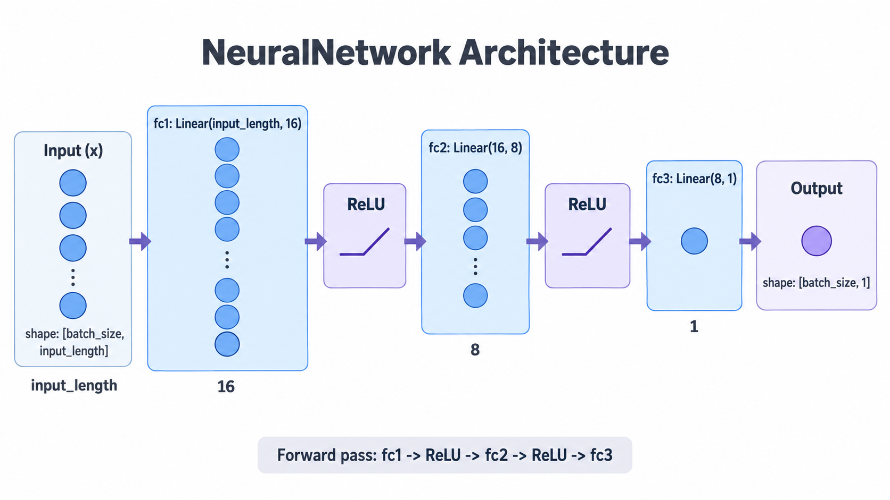

# Titanic Neural Network

This project contains data preprocessing and model training from preprocessed dataset and evaluation of the trained model.

## Dataset

### Columns

| Rows | Columns |
| ---- | ------- |
| 1309 | 28      |

The dataset contains 28 columns, but we use only 8 columns.

- PassengerId
- Age
- Fare
- Sex
- Sibsp
- Embarked
- Parch
- Survived

Informations from Kaggle.

| Views | Downloads | Comments  |
| ----- | --------- | --------- |
| 665K  | 168K      | 17        |

[Click for Kaggle](https://www.kaggle.com/datasets/heptapod/titanic).

---

## Neural Network



Architecture
```text
Input
 |
Linear(input_length -> 16)
 |
ReLU
 |
Linear(16 -> 8)
 |
ReLU
 |
Linear(8 -> 1)
 |
Output

```

The network consists of three fully connected (linear) layers.
- Input Layer: Accepts input length features.
- Hidden Layer 1: 16 neurons followed by a ReLU activation.
- Hidden Layer 2: 8 neurons followed by a ReLU activation.
- Output Layer: Produces a single scalar output.

#### Activation Function

ReLU is used as activation function.

---

## Let's Start

Let's create venv and activate

```bash
python -m venv venv
venv/Scripts/activate
```

Let's install required libraries.

```bash
pip install -r requirements.txt
```

Train the Model

```bash
python train.py
```
